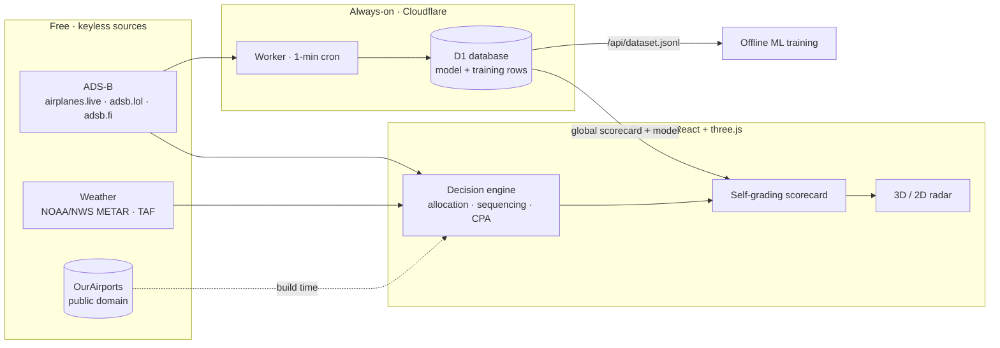

# Naventra — AI Air Traffic Command

An AI-native air traffic control console that works **real, live air traffic** — and
**grades its own AI against reality, 24/7.** It ingests live ADS-B transponder returns
around 15 of the world's busiest airports, pulls live weather, and runs an autonomous ATC
decision core that does the controller's job — then locks each prediction and measures it
against what actually happened.

[](https://github.com/Rian-Fernando/Naventra/actions/workflows/ci.yml)
[](https://github.com/Rian-Fernando/Naventra/actions/workflows/codeql.yml)
[](LICENSE)
[](#data-sources-all-free-no-api-keys)
[](https://naventra.rianfernando.com/live)

**▶ Live: [naventra.rianfernando.com](https://naventra.rianfernando.com)** · [Live console](https://naventra.rianfernando.com/live) · [Operator's Guide](https://naventra.rianfernando.com/guide)

<!-- Tip: drop a short screen-capture GIF of the live radar at docs/demo.gif and
     swap the image below to  — a moving hero is the
     single biggest driver of stars for a project like this. -->


## Why it's different

Most "AI" demos never check themselves. Naventra does: when an inbound flight commits to
final, the engine **locks** its plan — arrival runway, touchdown ETA, landing order, active
configuration — and when the flight lands, ground truth is derived purely from the observed
track and every locked item is graded ✓/✗. The all-time and trailing-24h accuracy is shown
live, per category, with a rolling log. **It's an AI that publishes its own report card.**

Kept honest: only live traffic banks into the persistent score (simulated traffic is graded
on screen but never persisted); go-arounds void their predictions; unclassifiable landings
are discarded rather than guessed; conflict advisories aren't graded — a controller resolving
a predicted conflict is not a miss.

## Architecture



The entire decision engine runs client-side. The Cloudflare Worker is an optional backend
that runs the **same** engine 24/7 so the score keeps improving with no browser open.

## What the console does

- **Runway configuration** — head/crosswind for every runway end from the live METAR; selects
  the active arrival/departure config, flags crosswind advisories.
- **Weather Outlook** — pulls the live **TAF** and projects when the wind will flip the runways,
  plus a transparent disruption-risk estimate per forecast period.
- **Arrival sequencing** — classifies each track by phase (enroute → arrival → approach → final
  → ground), orders arrivals by ETA and distributes them across active parallel runways.
- **Separation monitoring** — pairwise closest-point-of-approach with a 150 s lookahead against
  3 nm / 1,000 ft minima; VFR, rotorcraft and slow low-level traffic excluded like real STCA.
- **Emergency detection** — squawk 7500 / 7600 / 7700 and ADS-B emergency flags surface as
  priority alerts on the scope and strips.
- **Ground logistics** — arrivals get a real terminal + stand from the airport's gate layout.
- **Radio comms** — decisions voiced as realistic VHF phraseology on the facility's real
  frequencies, with airline telephony ("Speedbird", "Cathay", …) and pilot readbacks.
- **The scope** — a 3D TRACON view (drag to orbit, scroll to zoom, true-altitude stems, history
  trails) with a 2D top-down toggle; deep zoom (2–5 nm) draws real runways, thresholds and a
  schematic terminal layout.

## Always-on learning & the open dataset

A companion Cloudflare Worker (`worker/`) runs the engine on a 1-minute cron against JFK / LAX
/ LHR, grading real landings and banking the learned model into a free **D1** database. Set
`VITE_TRACKER_URL` and the frontend shows one continuously-improving global score; unset, it
runs fully client-side with per-browser learning.

Every graded operation is logged as a **labeled training row** — ~25 factors captured at lock
time (approach geometry, aircraft type + wake category, live wind components, ceiling, flight
category, time of day, runway config, traffic density, sequence) plus the observed outcome —
and exported as JSONL from `/api/dataset.jsonl`. That turns the tracker into a growing dataset
you can train a full ML model on offline (free, keyless) and serve back as pure-JS inference.
See [`worker/README.md`](worker/README.md) for the schema, deploy steps and a training recipe.

## Data sources (all free, no API keys)

| Feed | Source | Notes |
|---|---|---|
| Live traffic (primary) | [airplanes.live](https://airplanes.live) | CORS-open, includes airframe type + operator |
| Live traffic (fallback) | [adsb.lol](https://adsb.lol), [adsb.fi](https://adsb.fi) | via proxy rewrites |
| Weather | [NOAA / NWS](https://aviationweather.gov) METAR + TAF | real observations & forecasts |
| Flight routes | [adsbdb.com](https://adsbdb.com) | callsign → origin/destination |
| Airports & runways | [OurAirports](https://ourairports.com/data/) | public domain, generated at build time |

If every live source is unreachable (or you press **LIVE OPS** to force SIM), a physics-based
simulation takes over, seeded with the airport's real runway geometry, carrier mix and current
weather. The engine, panels and comms run identically in both modes. See [`NOTICE.md`](NOTICE.md)
for full attribution.

## Airports

JFK · LAX · ATL · ORD · SFO · SEA · DFW · LHR · CDG · FRA · AMS · HND · HKG · SYD · DXB —
each with real runway lengths/headings, ILS coverage, tower/ground/approach/ATIS frequencies,
field elevation, terminals and gates.

## Run it

```bash
npm install
npm run dev        # http://localhost:5173
```

The Vite dev server proxies the non-CORS APIs (see `vite.config.js`). Deploy config for
**Vercel** (`vercel.json`) and **Netlify** (`netlify.toml`) is preconfigured — `npm run build`
and deploy as-is. Regenerate airport data with `node scripts/gen-airports.mjs`.

## Project structure

```
src/
  data/airports.js       generated airport DB (runways, freqs, gates, carriers)
  lib/                   geo/CPA math, ADS-B ingestion, weather, TAF forecast, sim
  engine/                pure decision core, grading, learning, forecast (shared with worker)
  hooks/useAtcSystem.js  orchestration: polling, failover, engine ticks, event diffing
  components/            Radar3D + RadarScope + console panels + landing scene
  pages/                 Landing, Guide, About / Data / Privacy
worker/                  optional Cloudflare Worker + D1: 24/7 tracker & dataset
scripts/                 airport-data generator, CI engine-regression suite
```

## License

[MIT](LICENSE) © Rian Fernando. Independent project — **not affiliated with any aviation
authority and not for operational use.**
